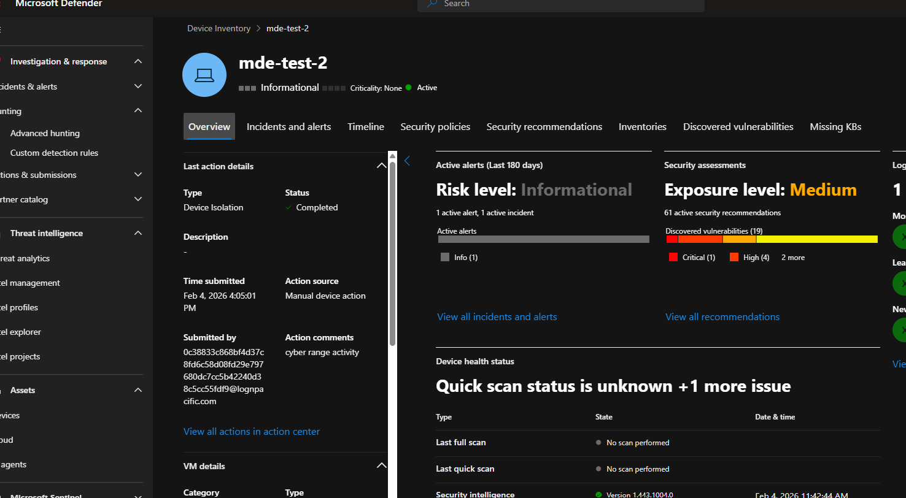
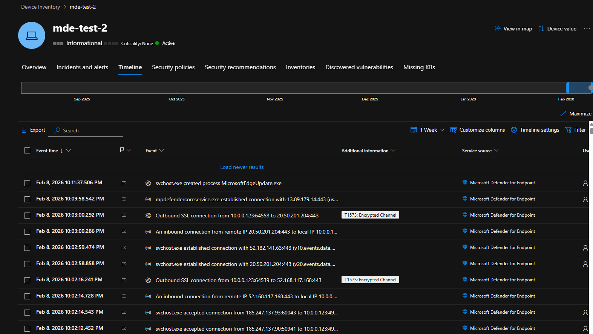

# A4 Microsoft Defender for Endpoint Telemetry

## Objective
Confirm that endpoint detection telemetry is being collected after the authentication attempts.

## Observation
The device MDE-TEST-2 appears as active in Microsoft Defender for Endpoint.

The device timeline shows multiple remote connection and authentication-related events recorded by the EDR sensor.

## Interpretation
This verifies that the endpoint is successfully onboarded and capable of recording security-relevant activity beyond native Windows logs.

## Importance
EDR telemetry allows analysts to investigate attacker behavior, correlate events, and perform threat hunting across the environment.


## Evidence





<br>

## Timeline Analysis (KQL)

To validate the device exposure from a hunting perspective, an advanced hunting query was executed. 
The query confirms that mde-test-2 was internet facing for an extended period of time.

This correlates with the observed external authentication attempts and supports the exposure scenario.

### Query
```kql
DeviceInfo
| where DeviceName == "mde-test-2"
| where IsInternetFacing == true
| order by Timestamp desc

